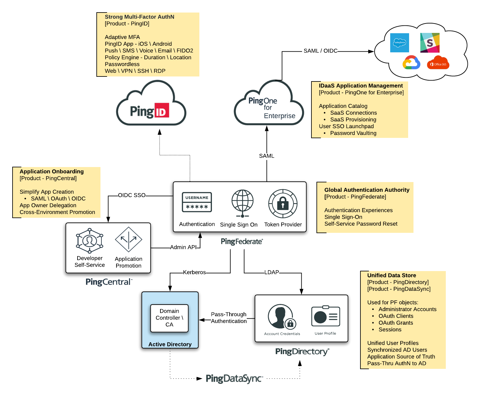

---
The Ping [**Workforce360**](https://www.pingidentity.com/en/solutions/workforce-identity/workforce360.html) Solution provides an Enterprise package that includes:
* Global Authentcation Authority (PingFederate) 
* Strong Multi-Factor Authentication (PingID) 
* Unified Data Store (PingDirectory & PingDataSync) 
* Application Onboarding (PingCentral)

---
## Contents
* [Deployment](../Deployment/Compose)
  * [Pre-Requisites](deployment-prerequisites.md)
  * [Environment Variables](deployment-variables.md)
* [Post Deployment](./postdeployment.md)
* Configuration
  * [Admin Consoles](config-consoles.md)
  * [Authentication Authority (PingFederate)](config-pingfed.md)

---

### Users
If you are using the AD Configuration in this repo, the following users can be used to test with:

**Active Directory**
* `pinguser1` / `2FederateM0re`  
* `pinguser2` / `2FederateM0re`

**PingDirectory**
* `user.[0-4]` / `2FederateM0re`

### **Windows Client - Integrated Authentication (Kerberos)**  
If you want to demo Kerberos:

* Point your Windows OS DNS Client to the Domain Controller IP Address
* Join the Windows client to your Domain
* Logon to the Windows Client with a Domain User
* Add your PingFed host to the Intranet Zone of IE 
  * (You can do this with Powershell -- [100-Configure-IntranetSites-in-IE.ps](ActiveDirectory/100-Configure-IntranetSites-in-IE.ps))
* If you want to use Edge -- Import the IE settings (Settings --> Import --> IE)
* Set your PF Connection --> Extended Properties to `Kerberos`
* If you see a pop-up -- you've missed a step in the configuration
* **Note:** Things look to be a little odd with untrusted certificates - you end up in a Kerb --> PingID loop, and PF doesn't pass you properly through the `resumePath`. 
   * Either trust the PF cert in the browser as an Exception, or add a proper cert to `SSL Certificates` in PingFed

## PingCentral
To access the Admin UI for PC go to:  
<https://{{PF_HOSTNAME}}:9022>

**Administrator**
* `administrator` / `2FederateM0re`

**Application Owner**
* `appowner.0` / `2FederateM0re`